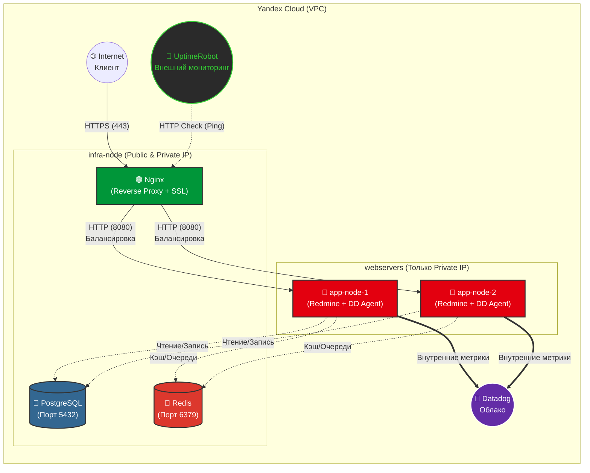
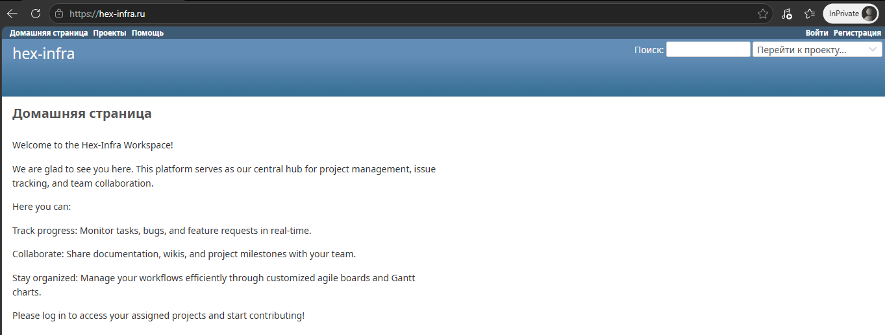
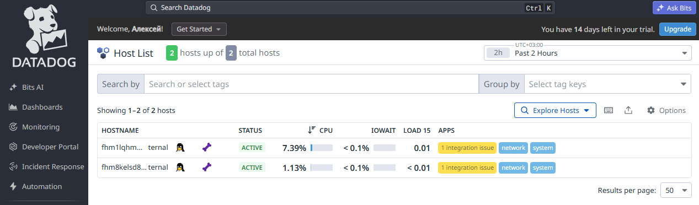
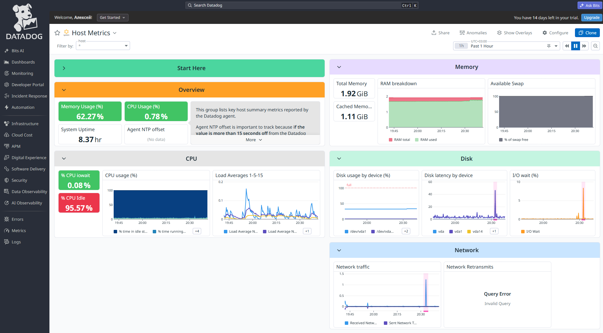
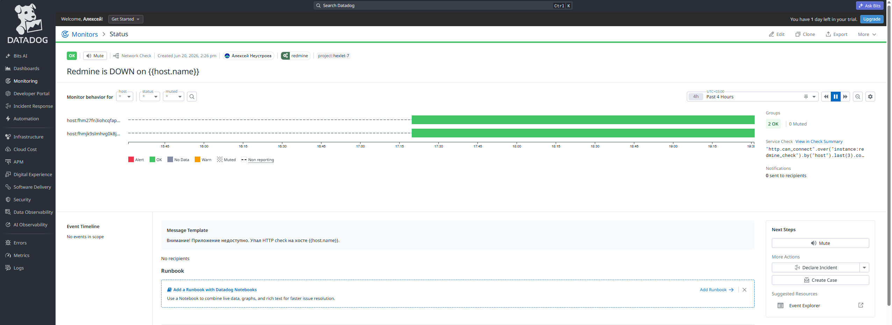
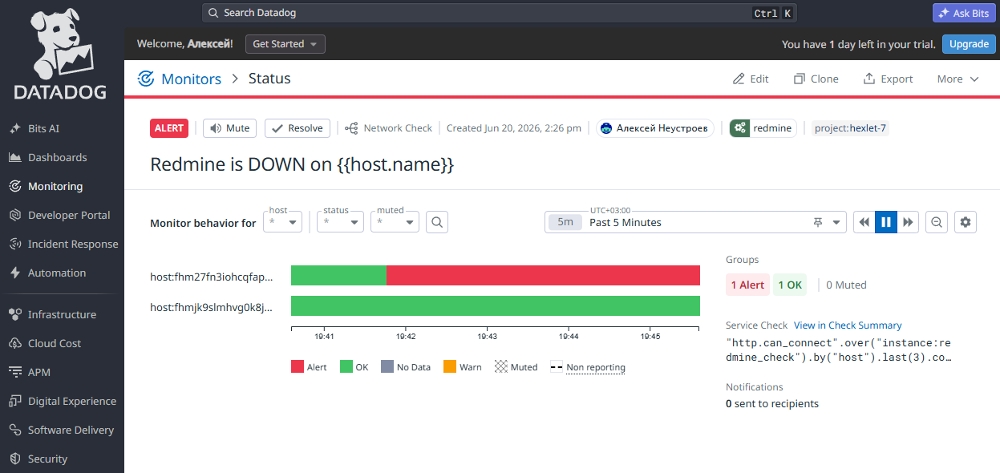
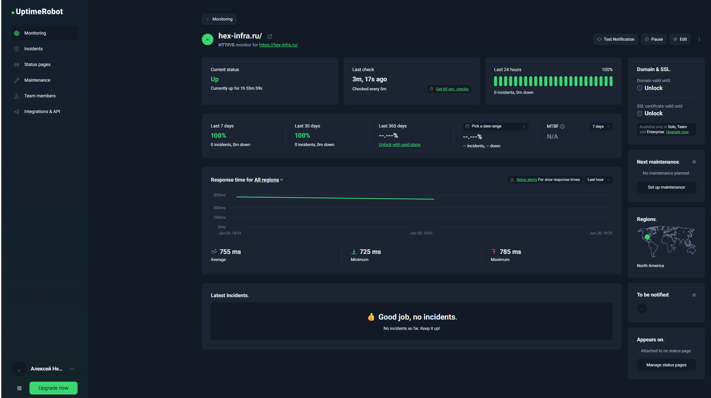
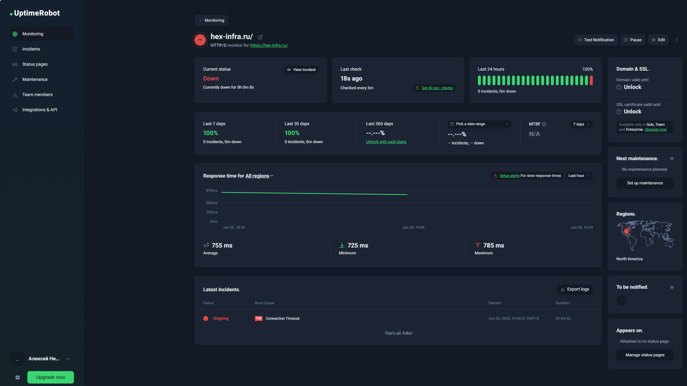
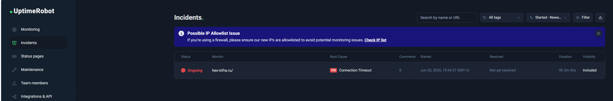

### Hexlet tests and linter status:
[](https://github.com/dobro10k2/devops-engineer-from-scratch-project-77/actions)

# Infrastructure as Code & Continuous Monitoring

This project automates the provisioning of cloud infrastructure and the configuration of a 3-node Docker cluster in Yandex Cloud using **Terraform** and **Ansible**.

The infrastructure is designed to host the **Redmine** containerized application with an **Nginx** load balancer (secured via fully idempotent Let's Encrypt SSL configuration), a **PostgreSQL** database, **Redis** for caching, and comprehensive monitoring using **Datadog** (with alerts managed via Terraform) and **UptimeRobot**. Terraform state is securely stored remotely in a Yandex Object Storage (S3) bucket.

## Live Application
**URL:** [https://hex-infra.ru](https://hex-infra.ru)

## Architecture & Tech Stack

* **Cloud Provider:** Yandex Cloud
* **Infrastructure as Code (IaC):** Terraform (v1.5.0+) with **Remote S3 Backend**
* **Configuration Management:** Ansible (v2.10+) with **Ansible Vault** for secrets management
* **OS:** Ubuntu 22.04 LTS
* **Containerization:** Docker Engine & Docker Compose
* **Application:** Redmine (Ruby on Rails)
* **Database:** PostgreSQL 15 (Containerized)
* **Caching & Queue:** Redis
* **Reverse Proxy & SSL:** Nginx + Certbot (Idempotent Let's Encrypt integration)
* **Internal Monitoring & Alerts:** Datadog (Infrastructure, APM, and Terraform-provisioned availability monitors)
* **External Monitoring:** UptimeRobot (Blackbox HTTP uptime checks)
* **DNS:** Automated A-record creation for `hex-infra.ru`

**Nodes Provisioned:**
1. `infra-node`: Hosts the Nginx Load Balancer, PostgreSQL database, and Redis service.
2. `app-node-1`: Application worker node (Redmine container + Datadog Agent).
3. `app-node-2`: Application worker node (Redmine container + Datadog Agent).

## Prerequisites

Before you begin, ensure you have the following installed on your local control machine:
* [Terraform](https://developer.hashicorp.com/terraform/downloads) (>= 1.5.0)
* [Ansible](https://docs.ansible.com/ansible/latest/installation_guide/intro_installation.html)
* `make` utility
* SSH key pair generated (default expected path: `~/.ssh/id_ed25519.pub`)

## Setup & Configuration

1. **Clone the repository:**
   ```bash
   git clone <your_repository_url>
   cd <repository_name>
   ```

2. **Configure Remote State (S3 Backend):**
   Create a `secret.backend.conf` file inside the `terraform/` directory with your Yandex Service Account static access keys. This is required for remote state management:
   ```ini
   access_key = "your_s3_access_key"
   secret_key = "your_s3_secret_key"
   ```
   *(Note: This file is ignored by Git).*

3. **Configure Terraform Variables & Datadog Keys:**
   Create a `terraform.tfvars` file inside the `terraform/` directory to store your Yandex Cloud credentials and Datadog API keys securely:
   ```hcl
   yc_token        = "your_yandex_oauth_token"
   yc_cloud_id     = "your_cloud_id"
   yc_folder_id    = "your_folder_id"
   datadog_api_key = "your_datadog_api_key"
   datadog_app_key = "your_datadog_app_key"
   ```
   *(Note: This file is ignored by Git).*

4. **Configure Ansible Vault Password:**
   Sensitive variables (DB passwords, Redis passwords) are encrypted. You must create a `.vault_pass` file in the root directory containing the decryption password:
   ```bash
   echo "your_secure_vault_password" > .vault_pass
   ```
   *(Note: This file is ignored by Git).*

## Usage

The project includes a `Makefile` to simplify deployment, linting, and formatting operations.

### 1. Provision Infrastructure
Initialize Terraform (connecting to the remote S3 backend) and provision the Virtual Machines, Network, Security Groups, DNS zone, and Datadog monitors.
```bash
make tf-init   # Executes: cd terraform && terraform init -backend-config=secret.backend.conf
make tf-apply
```
*Note: Upon successful application, Terraform automatically generates the `inventory.ini` file with the newly assigned IP addresses.*

### 2. Code Quality & Linting
Ensure your Infrastructure as Code meets industry standards before deploying.
```bash
# Format and validate Terraform code
make tf-fmt
make tf-lint

# Lint and auto-fix Ansible playbooks
make ansible-lint
make ansible-fix
```

### 3. Configure Servers
Download the required Ansible Galaxy roles and prepare the nodes (installing Docker and core dependencies).
```bash
# Verify SSH connectivity
make ansible-ping

# Install dependencies (pip, docker, nginx, datadog, redis)
make install

# Execute the setup phase (installs Docker Engine)
make setup
```

### 4. Manage Secrets (Ansible Vault)
To securely update passwords or API keys:
```bash
make vault-edit     # Safely edit encrypted secrets
make vault-encrypt  # Encrypt a newly created vault.yml
make vault-decrypt  # Decrypt the vault.yml for viewing
```

### 5. Deploy Application
Deploy infrastructure services (PostgreSQL, Redis), start Redmine containers, configure Nginx with SSL, and initialize Datadog monitoring agents.
```bash
make deploy
```

### 6. Teardown
To destroy all created resources and avoid further cloud charges:
```bash
make tf-destroy
```

## Project Structure

```text
.
├── Makefile                # Automation commands (deploy, lint, format, vault)
├── README.md               # Project documentation
├── ansible/
│   ├── ansible.cfg         # Ansible configuration
│   ├── group_vars/
│   │   ├── all.yml         # Global variables (domain, email, Nginx upstreams)
│   │   ├── infra.yml       # Infra node config (Redis bind interface)
│   │   └── webservers/
│   │       ├── vars.yml    # App config (Datadog site, ports, DB/Redis hosts, Nginx SSL)
│   │       └── vault.yml   # Encrypted secrets (Passwords)
│   ├── playbook.yml        # Main playbook logic
│   ├── requirements.yml    # Ansible Galaxy dependencies
│   └── templates/          # Jinja2 templates (e.g., .env.j2)
├── img/                    # Visual documentation assets
└── terraform/
    ├── backend.tf          # S3 Remote State configuration
    ├── dns.tf              # DNS zone and A-record for hex-infra.ru
    ├── inventory.tftpl     # Template for dynamic Ansible inventory
    ├── main.tf             # Core resources (VM provisioning, VPC, Security Groups)
    ├── monitoring.tf       # Datadog provider and availability monitors
    ├── outputs.tf          # Outputs and local_file generator for inventory
    ├── provider.tf         # Yandex provider configuration
    ├── terraform.tfvars.example # Example variable definitions
    └── variables.tf        # Variable declarations
```

## Architecture Diagram



## Visual Documentation

### 1. Application & SSL
The Redmine application is securely accessible via HTTPS, with certificates automatically provisioned and managed idempotently by Let's Encrypt through the Nginx reverse proxy.


### 2. Infrastructure Monitoring & Alerts
All application nodes are actively monitored using **Datadog**. Automated alerts are provisioned via Terraform to notify the team upon HTTP check failures. External availability is verified via **UptimeRobot**.

#### A. Datadog





#### B. UptimeRobot




## Security Notes

* **Terraform State:** Stored remotely in Yandex Object Storage (S3) — never committed to Git
* **Secrets:** All sensitive data encrypted with Ansible Vault
* **Credentials:** Passed via environment variables or ignored config files
* **SSH Keys:** Public keys only; private keys never stored in repository
